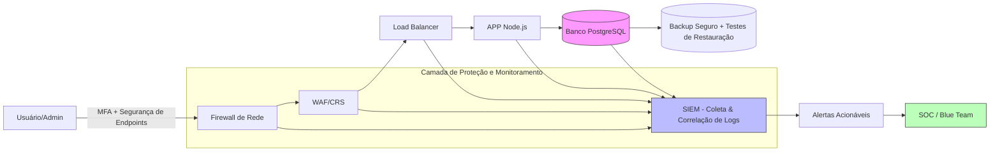

# 🚀 Desafio Final – Módulo 2 Defesa e Monitoramento  
Projeto Final Módulo 2 Defesa e Monitoramento – Formação CyberSec (Vai na Web + Kensei Cybersec)

💼 **Projeto de Segurança para LojaZeta (E-commerce fictício)**  
Este projeto tem como objetivo apresentar uma proposta de segurança e monitoramento destinada à empresa fictícia LojaZeta, a qual atua no setor de comércio eletrônico e enfrentou recentemente incidentes relacionados à segurança cibernética.

---

## 🧠 Objetivo do Projeto
Implementar uma estratégia de segurança cibernética com foco em:  
- Detecção e resposta a incidentes.  
- Fortalecimento da infraestrutura contra ataques comuns.  
- Centralização de logs e visibilidade em tempo real.  
- Estruturação de roadmap de ações (80/20) priorizando maior impacto.  

---

## 🏗️ Arquitetura de Defesa em Camadas

---
## 📊 Monitoramento & SIEM

**Fontes de Log:**  
- Nginx  
- Aplicação Node.js  
- PostgreSQL  
- Sistema Operacional  
- Firewall  
- WAF  

**Correlação de Eventos:**  
- Tentativas de brute-force em `/login`.  
- Ataques SQLi e XSS bloqueados pelo WAF.  
- Acessos suspeitos fora da região.  

**KPIs / Métricas:**  
- MTTD (Mean Time to Detect).  
- MTTR (Mean Time to Respond).  
- Número de tentativas de ataque bloqueadas.  
- % de cobertura de logs.  

---

## 🛡️ Resposta a Incidentes (NIST IR)

**Fluxo de resposta adotado:**  
1. **Detecção** → SIEM gera alertas.  
2. **Contenção** → Bloqueio de IPs maliciosos / isolamento de hosts.  
3. **Erradicação** → Remoção de malware, aplicação de patches.  
4. **Recuperação** → Restauração de backups.  
5. **Lições Aprendidas** → Documentação e melhoria contínua.  

📘 **Runbooks definidos para:** SQLi, XSS, brute-force e indisponibilidade.  

---

## 📅 Plano de Implementação (80/20)

| Ação                          | Impacto | Facilidade | Prioridade |
|-------------------------------|---------|------------|------------|
| Configurar SIEM e integrar logs | Alto    | Média      | Alta     |
| Implementar MFA para admins   | Alto    | Alta       | Alta       |
| Reforçar regras do WAF        | Alto    | Média      | Alta       |
| Automatizar backups/testes    | Alto    | Alta       | Alta       |
| Criar dashboards de segurança | Médio   | Média      | Média      |
| Definir runbooks de resposta  | Médio   | Média      | Média      |
| Treinar equipe básica em IR   | Médio   | Alta       | Média      |

---

## ⚠️ Riscos, Custos e Assunções

**Riscos:** falsos positivos no SIEM, custo crescente de logs.  
**Custos Estimados:** soluções open-source (baixo custo inicial), equipe SOC reduzida.  
**Assunções:** orçamento limitado, equipe pequena, automação é chave.  

---

## ✅ Conclusão e Próximos Passos

Este projeto define uma arquitetura robusta, mas viável para a **LojaZeta**.  

**Próximos Passos:**  
- Integrar todos os logs ao SIEM.  
- Criar dashboards de visibilidade.  
- Validar runbooks em exercícios simulados.  

**Critérios de Sucesso:**  
- Redução de MTTD/MTTR.  
- Bloqueio efetivo de SQLi/XSS.  
- Backups testados e funcionando.  
- Equipe preparada para responder a incidentes.  

---

## 📌 Recursos Utilizados  
- Diagramas criados no **Draw.io** e **Mermaid (GitHub)**  
- Documentação estruturada em **Markdown e Google Docs**  
- Baseado em boas práticas de **NIST, MITRE ATT&CK e CIS Controls**  

---

## ✅ Conclusão  
Este projeto apresenta uma solução prática e viável para aumentar a segurança da LojaZeta, unindo **defesa em camadas, monitoramento inteligente e resposta a incidentes**. Mesmo com restrições de equipe e orçamento, a empresa poderá **reduzir riscos críticos**, **melhorar a resiliência operacional** e **garantir continuidade de negócios**.  

---
## 📘 Documentação do Projeto  
📘 O documento PDF completo do projeto está disponível logo acima do README.md ☝️ 

---

✍️ **Autor**  
George Silva Monteiro  
*Entusiasta em Cybersegurança 📍 Brasil*  
